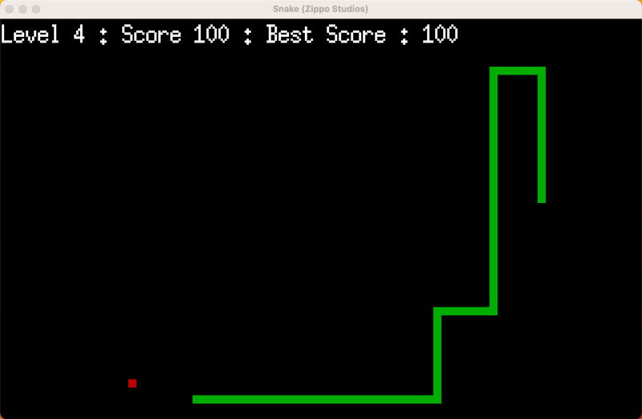

# Snake-Go

[](LICENSE)

Welcome to Snake-Go game! 🐍

Snake-Go is a classic arcade game built in Go. It's a fun and addictive game where you control a snake, guiding it to eat apples and grow longer while avoiding collisions with the walls or its own tail.

## Features

- Intuitive controls: Use the arrow keys to navigate the snake.
- Levels of increasing difficulty: Challenge yourself with faster gameplay as you progress.
- Score tracking: Keep track of your high score and compete with friends.
- Beautiful graphics: Enjoy a visually appealing game interface.

## Screenshots



## Installation

To play Snake-Go, follow these steps:

1. Clone the repository:

```shell
$ git clone git@github.com:juanantoniocid/snake-go.git
```

2. Build and run the game:

```shell
$ make
$ ./snake-go
```
# Usage

To play Snake-Go, use the arrow keys to navigate the snake. The snake will move in the direction of the arrow key you press. The goal is to eat as many apples as possible without colliding with the walls or the snake's own tail. The game ends when the snake collides with the walls or its own tail.

To reset the game, press the `ESC` key.

To quit the game, press the `Q` key.

# Dependencies

The Snake-Go project has the following dependencies:

* Go version 1.20 or higher

# License

Snake-Go is open source and available under the MIT License.

# Support

If you have any questions, suggestions, or need help, feel free to reach out to me at yo@juancid.com.

Enjoy the game and happy coding! 😄